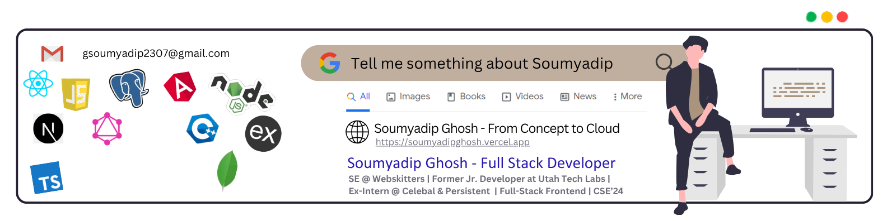

Frontend Engineer · Full-stack capable · Performance-minded

I'm Soumyadip Ghosh, a tech person working on some stuff - and a bit of it's here. I like building things that go fast to serve many people, so that we all get a little more time to use elsewhere.

---

### Where you can find me

- Here on GitHub — you’re already in the right place 🙂
- Portfolio: https://soumyadipghosh.vercel.app
- LinkedIn: https://www.linkedin.com/in/soumyadipghosh23/
- Email: gsoumyadip2307@gmail.com

---

### What I work with

  

I mostly work with **React / Next.js / TypeScript**,  
and I’m comfortable going end-to-end — backend, infra, CI/CD — when needed.

---

### Things I’ve built (or helped build)

**Capital Revival (Reaper Financial)**  
Web3 finance platform for community-driven debt repayment via governance  
→ https://www.reaper.financial

**Qaira**  
Enterprise survey platform with advanced logic, quotas, and AI workflows  
→ https://qaira-dev.dedicateddevelopers.us/

**SRI Fine Art Services**  
Workflow-heavy logistics system for high-value assets  
→ https://srifas.com

**Rasha Professional**  
Large-scale ERP + commerce platform (B2B + B2C)  
→ https://www.rashaprofessional.com

**Pantry Plenty**  
AI-powered meal planning with real-time collaboration  
→ https://www.pantryplenty.com

**react-portfolio-ai-chatbot**  
An open-source npm package for portfolio chat assistants  
→ https://www.npmjs.com/package/react-portfolio-ai-chatbot

---

### A few numbers (for the curious)

  
  &nbsp;&nbsp;&nbsp;
  

---

If something here looks useful or interesting, feel free to reach out.
