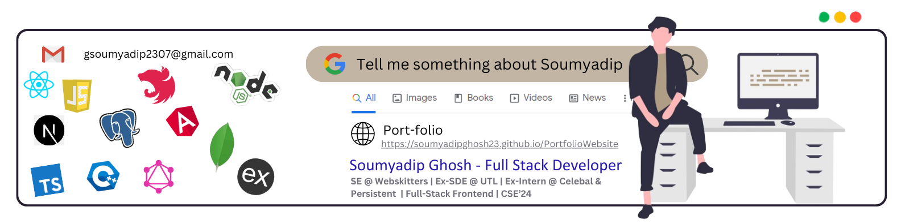

<h1 align="center">Hey 👋, I'm Soumyadip Ghosh</h1> 

  Frontend Developer | Software Engineer @ Utah Tech Labs | Ex-Celebal & Persistent | Competitive Coder | MERN & C++ Enthusiast | AI Curious 🚀

---

### 🚀 Who Am I?

- 🧠 A **Frontend Developer** with 2+ years of experience building **high-performance, scalable** apps in **React**, **Next.js**, and **TypeScript**.
- 🌐 Currently crafting AI-powered and real-time web solutions @ **Utah Tech Labs**, serving 10K+ users.
- 🔄 Backend-ready: Node.js, Express, GraphQL, REST, PostgreSQL, AWS Lambda.
- 🧰 DevOps & Cloud: Docker, GitHub Actions, AWS (EC2, S3), CI/CD pipelines.
- 📚 Lifelong learner — exploring **Inngest**, **agentic AI workflows**, **Kubernetes**, and **RAG systems**.

---

### 🧰 Tech Stack

#### 💻 Languages:

#### 🌐 Frontend:

#### 🛠️ Backend & Infra:

---

### 🔥 Projects Worth Checking

**🔷 Pantry Plenty (AI Meal Planner)**  
> Built AI-powered meal planner using ChatGPT + web scraping + Instacart APIs. Boosted UX, saved 60% manual effort.

**🔷 Capital Revival**  
> Debt automation platform: Migrated to Next.js 15, enhanced with GraphQL, Redux, Zod, and CI/CD (Heroku deploy).

**🔷 SRI Logistics**  
> Full-stack logistics app with admin panel, invoicing, employee/task management – cut manual effort by 40%.

---

### 📈 GitHub Stats

  
  
  

---

### 🏅 Achievements

- 🥇 180+ problems solved on [LeetCode](https://leetcode.com/u/SoumyadipGhosh23/)
- 🏆 Ranked 20th in college (600 pts) on [GFG](https://auth.geeksforgeeks.org/user/soumyadip2307/)
- 🌟 5-star badges in C, C++, and SQL on [HackerRank](https://www.hackerrank.com/gsoumyadip2304)
- ✍️ Published articles on GFG — check [my blogs](https://auth.geeksforgeeks.org/user/soumyadip2307/)

---

### 🧩 My Badge Collection

---

### 📬 Let's Connect!

  
  
  
  

---

### 👀 Visitors & Followers

  
  

